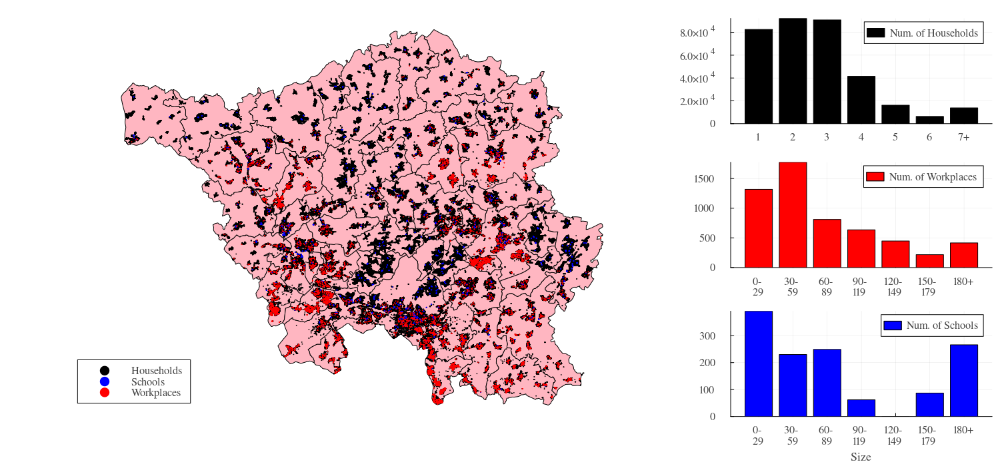
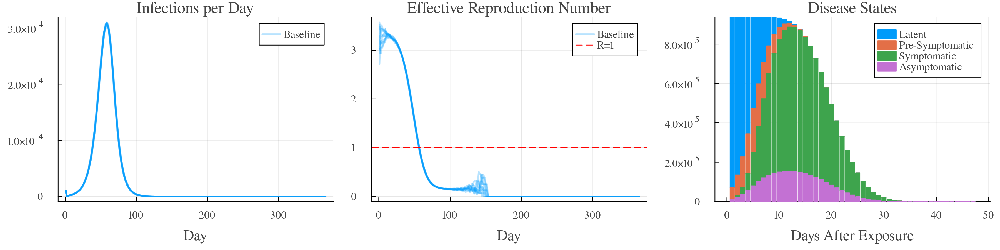
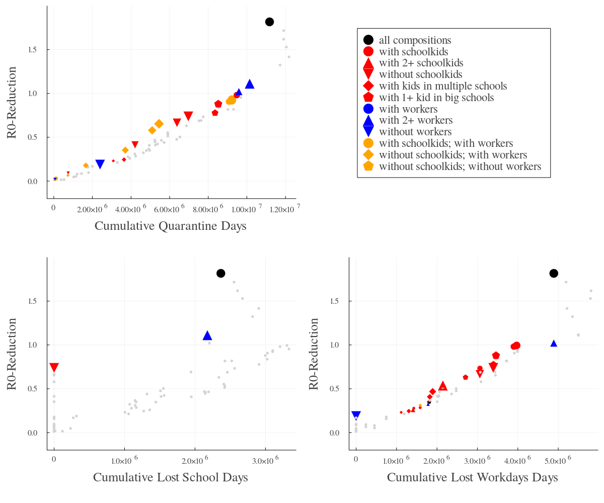

# Targeted Household Quarantining

This repository contains the code to reproduce the simulation experiments in:

> Ponge, J., Patzner, J., Hellingrath, and Karch, A., 2025. Targeted Household Quarantining: Enhancing the Efficiency of Epidemic Responses. Submitted to *2025 Winter Simulation Conference (WSC)*


## Abstract

Non-pharmaceutical interventions (NPIs) are the immediate public health reaction to emerging epidemics.
While they generally help slow down infection dynamics, they can be associated with relevant socioeconomic costs, like lost school- or work days caused by preemptive household quarantines.
However, research suggests that not all households contribute equally to the overall infection dynamics.
In this study, we introduce the novel “Infection Contribution” metric that allows us to trace the involvement of particular household types over entire infection chains. Building upon the German Epidemic Microsimulation System,
we quantify the impact of various household types, considering their size and composition in a COVID-19- like scenario.
Additionally, we show how targeting interventions based on household characteristics produces efficient strategies, outperforming non-selective strategies in almost all scenarios.
Our approach can be transferred to other NPIs, such as school closure, testing, or contact tracing, and even inform the prioritization of vaccinations.

## Model

Our agent-based simulations are done in v0.4.3 of the [German Epidemic Microsimulation System (GEMS)](https://github.com/IMMIDD/GEMS) Julia package.
We use the population model for the Western-German federal state of Saarland with roughly one million individuals.



Moreover, we simulate a COVID-19-like disease scenario to test various intervention strategies.
Here's what an unmitigated case looks like:




# (Some) Results

The graphs below show how quarantining strategies targeting households based on various composition- and size-attributes differ significantly regarding their potential to "flatten the curve" (R0-Reduction) and the incurred quarantine days as well as lost school- and workdays.




## Run the Experiments

Given that you have [Julia 1.11.3+](https://julialang.org/) installed, 
you can either clone the repository and run `pkg> instantiate` in your repository clone or start with a fresh script and install these experiments as a package like:

```julia
using Pkg
Pkg.add(url = "https://github.com/IMMIDD/Household-Isolation")
```

Then, load the package and run the experiments like this:

```julia
using GEMS_HH_Isolations
run_experiments()
```

This will generate a new folder in your current working directory called `results`.
Every time you execute `run_experiments()`, a new timestamped subfolder will be generated in your `results` folder that will contain raw data outputs, processed and summarized data about the results, and the graphs that you see above (among others).
The default number of simulation runs for the baseline scenario and each of the quarantining scenarios is `10` which will take multiple hours on most machines to complete given that there are `72` scenarios.
You can pass the optional `num_of_baseline_sims` and `num_of_scenario_sims` arguments to decrease (or increase) the number of simulation runs.
If you want to re-run these experiments with other configurations (some options are in the `/models` folder), pass the `input_config` argument with the path to a configfile.
To change the baseline population, pass the `population_model` arugument with a German state identifier (e.g., Saarland is `SL`; Berlin is `BE`; Sachsen-Anhalt is `ST`; ...)